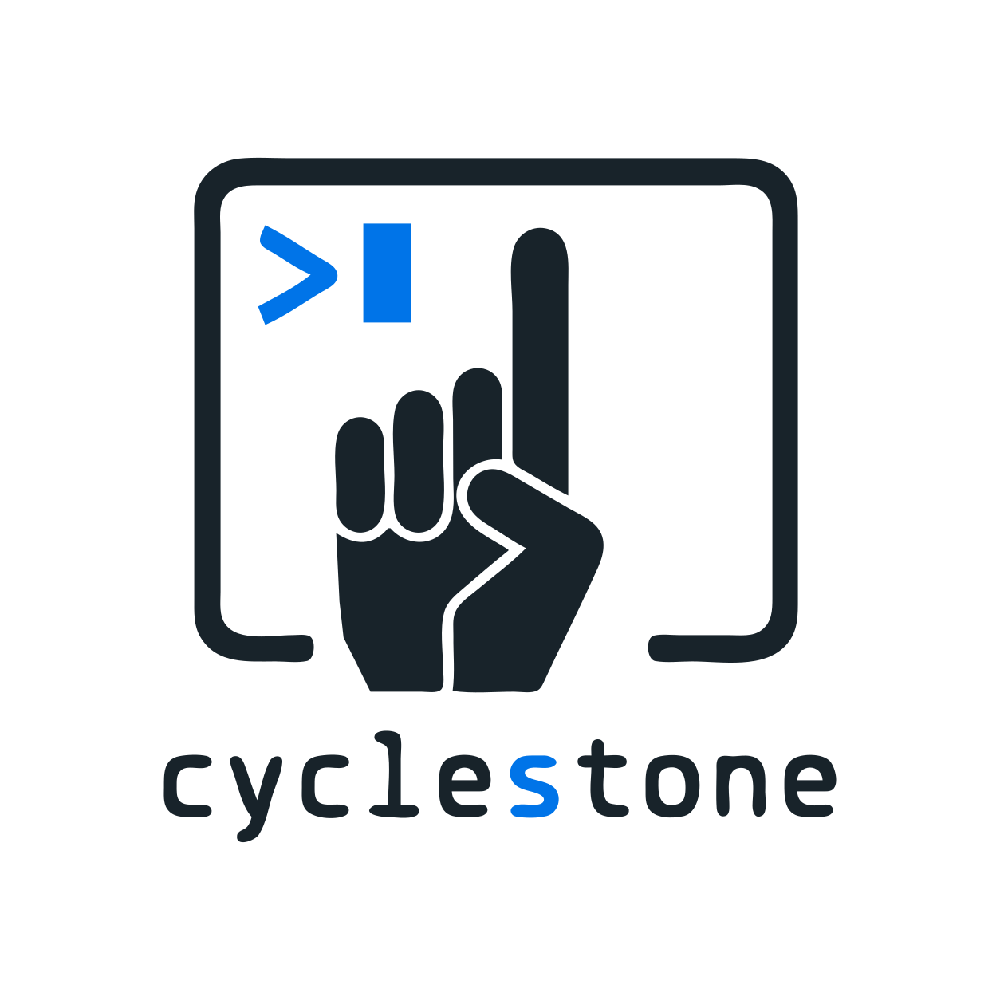

<div align="center">
  <picture>
    <source media="(prefers-color-scheme: dark)" srcset="assets/public/logo/cyclestone-logo-dark-mode.svg">
    <source media="(prefers-color-scheme: light)" srcset="assets/public/logo/cyclestone-logo-light-mode.svg">
    
  </picture>
    <div align="center"><strong >Multi-Agent Software Engineering in Your Terminal</strong></div>
</div>

<br />

<p>
  Cyclestone brings structure, safety, and reviewability to AI coding agents. It turns AI-driven development into milestones, runs them through specialized agent cycles, and keeps every step auditable with Git-based snapshots.
</p>

<br>

> [!NOTE]
> **Cyclestone is currently in alpha.** You may encounter bugs or unexpected behavior. At this stage, the project is tested and works well primarily with the `codex` and `agy` runners.

<br />

---


# 🌊 Cyclestone

## 💡 What is Cyclestone?

AI coding agents are powerful, but raw autonomy can be hard to trust. A single prompt may touch files across your project, mix planning with implementation, and leave you reviewing a pile of changes without a clear trail of intent.

**Cyclestone** gives developers a controlled way to use agentic coding without surrendering the workflow. It is a local-first, terminal-native engineering assistant that breaks work into explicit milestones, coordinates specialized PM, Developer, and QA agents, and keeps every cycle auditable through Git-based branch snapshots.

The result is practical AI automation for real codebases: faster iteration, clearer scope, safer reviews, and a workflow that keeps the developer in charge.

## How it works

### 1. Create a milestone

<p>
  <div>Turn a rough task into a structured, executable milestone:</div>
  
</p>

### 2. Run a milestone

<p>
  <div>Execute the milestone in focused cycles until the result is done:</div>
  
</p>

---

## ✨ Features

- 💻 **Interactive TUI**: View active milestones, inspect agent logs, and review run history in a beautiful terminal dashboard designed with [Lipgloss](https://github.com/charmbracelet/lipgloss).
- 🛡️ **Git-Safe Workflows**: Automatically creates milestone branches such as `cyclestone/milestones/0001-project-setup` and captures snapshots so you can revert or audit any cycle instantly.
- 👥 **Multi-Agent Pipelines**:
  - **Milestone Creator**: Analyzes the codebase and drafts spec files.
  - **Project Manager**: Refines scope, lists acceptance criteria, and highlights risks.
  - **Developer**: Safely modifies code to hit the milestone goal.
  - **QA**: Automatically runs tests and checks acceptance criteria.
- ⚙️ **Compact YAML Index**: Keep milestone metadata in `.cyclestone/milestone.yml`, detailed specs in `.cyclestone/milestones/`, and runtime progress in `.cyclestone/state.json`.

---

## 🚀 Quick Start

### Prerequisites

- Go 1.24.2 or later.
- Git.
- At least one supported runner:
  - `codex`: OpenAI Codex CLI installed and authenticated. This is the default runner.
  - `agy`: `agy` CLI installed and authenticated.
  - `ollama-codex`: Ollama can be run through Codex when both `ollama` and `codex` are installed and available on `PATH`.

### 1. Installation

#### Recommended Method (`go install`)
Install the tool directly via Go:

```bash
go install github.com/patrick-folster/cyclestone/cmd/cyclestone@latest
```

*Note: Make sure your `$GOPATH/bin` (or `$GOBIN`) is in your system's `PATH` to run the command directly. If it isn't, you can add it by running:*

```bash
# Add to current terminal session:
export PATH=$PATH:$(go env GOPATH)/bin

# Or make it permanent for future bash sessions:
echo 'export PATH=$PATH:$(go env GOPATH)/bin' >> ~/.bashrc && source ~/.bashrc
```

#### Alternative Method (Manual Build)
If you prefer to build from source:

```bash
git clone https://github.com/patrick-folster/cyclestone.git
cd cyclestone
go build -o cyclestone ./cmd/cyclestone
```
*This produces a `cyclestone` binary in the current directory.*

#### Uninstallation
To remove the tool:

* **If installed via `go install`**:
  ```bash
  rm $(go env GOPATH)/bin/cyclestone
  ```
* **If built manually**:
  Simply delete the compiled `cyclestone` binary from your build directory.

### 2. Initialize a Project
Run the command in your project directory:

```bash
cyclestone
```
*(If you built manually, run `./cyclestone` instead).*

When `.cyclestone/milestone.yml` is missing and the terminal is interactive, Cyclestone opens a guided first-run setup wizard. The wizard lets you review the config and state paths, chooses a default runner from detected options, asks for sandbox or unrestricted mode, chooses branch behavior, and can optionally create the first milestone spec.

Setup writes files only after final confirmation:

- `.cyclestone/milestone.yml`
- `.cyclestone/settings.yml`
- `.cyclestone/state.json`
- `AGENTS.md` when you keep the editable preview enabled
- `.cyclestone/milestones/`
- `.cyclestone/milestones/<id>.md` when you create the first milestone

Runner detection checks `codex` and `agy` on `PATH`. The `ollama-codex` runner is offered when both Ollama and Codex are available on `PATH`. The default runner is the first available supported option. Setup warns when the current directory is not a Git worktree, but does not block initialization.

The wizard defaults to sandbox mode and automatic milestone branches. Selecting unrestricted mode requires an explicit confirmation before settings are saved. If `cyclestone` is run non-interactively and no config exists, it exits before launching the TUI; run it in an interactive terminal or provide an existing config path.

### 3. Run the TUI
Launch the interactive terminal interface:

```bash
cyclestone
```
*(If you built manually, run `./cyclestone` instead).*

---

## 🛠️ Configuration (`milestone.yml`)

Cyclestone uses a simple YAML specification file to coordinate milestones:

```yaml
milestones:
  - id: "0001-project-setup"
    title: "Project Setup & Base Architecture"
    spec_path: "milestones/0001-project-setup.md"
repositories:
  - "packages/api" # optional; git submodules and in-root worktrees are discovered automatically
```

Long-form goals and acceptance criteria live in the referenced markdown spec. Status, cycle counts, cycle-continuation recommendations, `AGENTS.md` update recommendation scores, and execution history live in `.cyclestone/state.json`.

### Runtime Settings (`settings.yml`)

Project runtime settings can live in `.cyclestone/settings.yml`. For example, use `max_llm_input_chars` to keep runner prompts below the selected model's input limit:

```yaml
default_llm: codex
default_mode: sandbox
auto_git_branch: true
max_llm_input_chars: 900000
agent_instructions:
  file: AGENTS.md
  propose_updates: true
  auto_apply_updates: false
```

`AGENTS.md` is an optional concise current operating instruction file loaded into agent prompts when present. `.cyclestone/DECISIONS.md` remains the chronological decision log. Cycles may propose `AGENTS.md` updates in handoffs and reports, and the recommender records a separate `agent_instructions_update_score` for whether a human should review durable instruction changes. Applying those changes still requires an explicit human review action; `auto_apply_updates` defaults to `false`.

### Sandbox and Consent

Cyclestone defaults to `default_mode: sandbox`. Keep this mode for normal use. The agents can still read project context, write `.cyclestone` runtime files, and ask the selected runner to edit repository files as part of a milestone.

Use `--unrestricted` or `default_mode: unrestricted` only after you understand the runner's permissions. Unrestricted mode removes the intended sandbox boundary for agent execution.

> [!WARNING]
> **⚠️ Unrestricted Mode & Security Isolation**
>
> **Unrestricted Mode grants the agent direct access to execute shell commands and modify code on your system.**
>
> While **unrestricted mode delivers the best results** (allowing the agent to run tests, compile code, execute linters, and self-correct based on command output), it also carries significant risks. LLM-generated code or execution of external tools can be unpredictable, hallucinated, or manipulated by malicious inputs.
>
> **Potential Hazards Include:**
> * 💥 **Data Loss & Deletion:** The agent or generated scripts might execute destructive commands (like `rm -rf`) on critical directories, deleting project files, databases, or local home directory contents.
> * 🔑 **Credential & Secret Theft:** Untrusted scripts or dependencies could scan for and exfiltrate environment variables, AWS/GCP/Azure API keys, SSH keys, `.env` files, or browser credentials to external endpoints.
> * 👾 **Malicious Payloads & Remote Execution:** The model might download and execute unverified external scripts, launch reverse shells, open local ports, or run unauthorized background processes.
> * 🌐 **Lateral Network Movement:** The runner process can connect to local network interfaces, database instances, or other systems on your intranet that are typically not exposed to the public web.
>
> **Recommended Safety Measures:**
> To benefit from unrestricted mode safely, **never run it directly with your primary user account on your main development machine.** Instead, use one of the following isolation strategies:
> 
> * **Virtual Machines (VMs):** Execute Cyclestone inside a virtual machine (e.g., UTM, Lima, VirtualBox) that can be easily snapshot-restored or discarded.
> * **Dedicated Low-Privilege User:** Run the agent under a separate system user account with restricted permissions, no `sudo` privileges, and no access to your primary home directory or sensitive SSH/API keys.
> * **Docker Containers / Devcontainers:** Run inside a containerized sandbox with minimal mounts, isolated network configuration, and no access to host credentials.

Before running a milestone cycle:

- Commit or stash unrelated work.
- Review `.cyclestone/milestones/*.md` and local agent prompts.
- Confirm the selected runner is installed, authenticated, and configured.
- Prefer milestone branches unless you intentionally pass `--no-branch-change`.

When you press `r` from a milestone, Cyclestone opens a preflight review before any runner starts. Confirming the review begins the normal cycle execution path; cancelling returns to milestone details without writing reports or metadata, saving cycle state, preparing executor files, or changing branches.

### Runner Notes

The default pipeline uses `codex`. You can select another runner in `.cyclestone/settings.yml` or the TUI.

| Runner | Requirement | Notes |
| --- | --- | --- |
| `codex` | Codex CLI on `PATH` and authenticated | Default. Uses Codex CLI sandbox/approval behavior. |
| `agy` | `agy` CLI on `PATH` and authenticated | External CLI runner. |
| `ollama-codex` | Ollama and Codex CLI on `PATH` | Runs Ollama through Codex by executing `ollama launch codex --model <model> -- <codex args>`. Defaults to `glm-5.2:cloud` unless `ollama_codex_model` is configured. |

### Known Limitations

- Agents can edit files through their runner. Review diffs before merging.
- Token budgets are estimates and should be treated as guardrails, not exact billing numbers.
- Remote Ollama or cloud model usage can create cost. Set model limits before large milestones.
- Local Ollama behavior depends on installed models, context limits, and host performance.
- Branch snapshots help audit work, but they are not a backup system.

### Project Files and Git Ignore

Generated runtime files usually should stay out of your application repository:

- `.cyclestone/state.json`
- `.cyclestone/reports/`
  - `<milestone-id>/summary.md`
  - `<milestone-id>/cycle-NNN/report.yaml`
  - `<milestone-id>/cycle-NNN/metadata.json`
  - `<milestone-id>/cycle-NNN/<phase-number>-<agent-id>/input.md`
  - `<milestone-id>/cycle-NNN/<phase-number>-<agent-id>/output.log`
  - `<milestone-id>/cycle-NNN/<phase-number>-<agent-id>/handoff.yaml`
- `.cyclestone/settings.yml` when it contains local preferences, hosts, or runner choices

Commit milestone specs only when you want the team to share them:

- `.cyclestone/milestone.yml`
- `.cyclestone/milestones/*.md`

### Architecture

See [docs/architecture.md](docs/architecture.md) for the milestone flow, agents, report files, branch behavior, and runner boundary model.

### Release Checklist

See [docs/release.md](docs/release.md) for tag format, GoReleaser output, and checksum verification.

---

## 🎨 Theme & Customization

Cyclestone comes built-in with an adaptive dark/light palette designed for high-contrast and visual clarity. Check out the styles module in [`internal/tui/styles.go`](internal/tui/styles.go) to customize colors, borders, and status tags to match your terminal setup.

---

## 🤝 Contributing

Contributions are welcome! Please feel free to open a Pull Request or file an Issue.

## ⚠️ Disclaimer

**Cyclestone** is an experimental AI-driven tool that reads, writes, and modifies local files, and (when unrestricted mode is enabled) can execute arbitrary shell commands on your system.

By using this software, you explicitly acknowledge and agree that:
- **No Liability:** In no event shall the authors, copyright holders, or contributors be liable for any claim, damages, or other liability, whether in an action of contract, tort, or otherwise, arising from, out of, or in connection with the software or the use or other dealings in the software.
- **No Warranty:** The software is provided "as is", without warranty of any kind, express or implied, including but not limited to the warranties of merchantability, fitness for a particular purpose, and non-infringement.
- **Assumption of Risk:** You assume all risks associated with running this tool. This includes, but is not limited to, data loss, codebase corruption, system configuration changes, unauthorized network operations, exfiltration of credentials/secrets, and financial costs incurred by configured AI runners or model services. Always run AI agents inside an isolated sandbox, virtual machine, or container, and carefully review all git diffs and logs.

## 📄 License

This project is licensed under the MIT License - see [LICENSE.md](LICENSE.md) for details.
